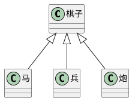

# 抽象类

## 为什么需要抽象类



有时，某个类只表示一个抽象概念，主要用于提取子类共有的成员，而不能直接创建它的对象。该类可以作为抽象类

给类前面加上关键字 ```abstract``` 表示该类是一个抽象类，不可以创建一个抽象类的对象

## 抽象成员

父类中，可能知道有些成员是必须存在的，但是不知道该成员的值或实现是什么，因此，需要有一种强约束，让继承该类的子类，必须要实现该成员

**抽象类中**，可以有抽象成员，这些抽象成员必须在子类中实现

## 设计模式 - 模版模式

设计模式：面对一些常见的功能场景，有一些固定的、经过多年实践的成熟方法，这些方法称之为设计模式

模版模式：有些方法，所有的子类实现的流程完全一致，只是流程中的某个步骤的具体实现不一致，可以将该方法提取到父类，在父类中完成整个流程的实现，遇到实现不一致的方法时，将该方法做成抽象方法

